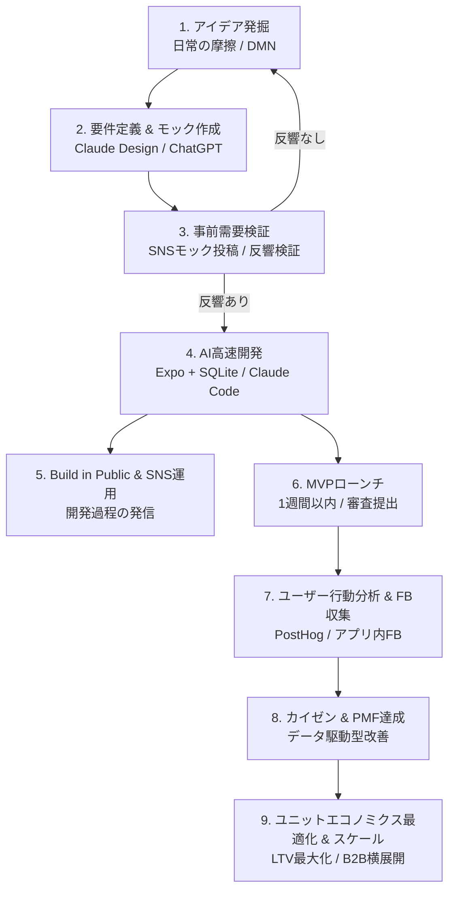

# AI-Driven App Monetization Playbook (アプリ開発・収益化ノウハウ完全プレイブック)

本ドキュメントは、AIツールを活用して最小限の時間とコストでアプリを立ち上げ、確実に収益化を達成するための実践型専門知識（Cheatsheet）です。

---

## 1. アプリ開発・収益化の標準9ステップフロー



1. **アイデアの発掘:**
   - 日常の小さな不便・イライラ（マイクロフラストレーション）に注目する。
   - 散歩、入浴、読書など、デフォルトモードネットワーク（DMN）が働くリラックス状態でアイデアを発想する。
2. **要件定義・LPおよびモック画面の作成:**
   - 機能を最小限に絞り、ChatGPTやClaude Design等で直感的に価値が伝わるプロトタイプ画面（モック画像）を作成する。
3. **需要検証（Pre-demand Validation）:**
   - モック画像をSNS（X等）に投稿し、インプレッションや反響（RT、いいね、リプライ）を確認する。
   - CPA計算やウェイティングリスト募集を行い、需要が確認できてから開発に着手する（反応が薄い場合はピボット）。
4. **AIツールによる開発スタート:**
   - Claude CodeやCodex（SwiftUI）を用い、プロンプト指示でコーディングを進める。
5. **SNS運用・ビルド・イン・パブリック（Build in Public）の実践:**
   - 開発中の苦労やUIモック、機能のこだわりをSNSで発信し、初期ファンを育成する。
6. **MVPローンチ（1週間スプリント）:**
   - 4〜5日〜1週間程度で迅速に初期バージョンをリリースする。過度な作り込みを避け、市場の初期反響収集を最優先とする。
7. **ユーザー行動分析とフィードバック収集:**
   - PostHogで離脱ポイントや課金行動を分析し、アプリ内FB導線から要望・不満を吸い上げる。
8. **改善によるPMF（Product-Market Fit）達成:**
   - ユーザーの声と行動データに基づき、コア機能の磨き込みを行う。
9. **ユニットエコノミクスの最適化とスケール:**
   - LTV/CACの健全化、価格最適化、さらに企業の業務課題解決（B2B案件化）へ展開する。

---

## 2. アイデア選定と需要検証（逆算思考のアプローチ）

### 2-1. 逆算思考 (Reverse Thinking) 計算モデル
「何が作れるか」ではなく、「達成したい収益目標」から逆算してパラメータを算出する。

- **目標収益:** 月200,000円
- **平均客単価 (ARPU):** 月額1,200円（または年額12,000円）
- **必要有料会員数:** 200,000 ÷ 1,200 ≒ **167人**
- **想定有料転換率 (CVR):** 1.0%
- **必要アクティブユーザー (MAU):** 167 ÷ 0.01 ＝ **16,700人**
- **許容顧客獲得単価 (CPA):** LTV（例: 継続月数6ヶ月 × 1,200円 = 7,200円）の1/3以下（2,400円以下）

### 2-2. ニッチジャンル・穴場テーマ選定マトリクス
| 分類 | 特徴 | 例 | 判定 |
| :--- | :--- | :--- | :--- |
| **レッドオーシャン** | 一般的、競合過多、無料代替多数 | 汎用ToDo、勉強タイマー、汎用シフト管理 | **回避** |
| **高収益ニッチ（穴場）** | 熱量が高い特定層、業務・生活直結、代替少 | 交代勤務者の夜勤手当自動計算、個人事業主の減価償却記録 | **推奨（月300〜800人の課金層）** |

### 2-3. 事前需要テスト手順
1. ChatGPT/Claudeでダッシュボード画面やメイン機能のモック画像を生成。
2. Xでターゲットの「痛み・悩み」を冒頭に添えて投稿。
3. 反響指標:
   - 高反響（開発着手）: 100いいね以上、または保存・引用RTが多数発生。
   - 中反響（調整）: 訴求メッセージやターゲットを変えて再投稿。
   - 低反響（ピボット）: アイデア自体を見直し、別の摩擦を探索。

---

## 3. 推奨技術スタックとAIツール活用

### 3-1. 技術スタック選定基準
- **フロントエンド（2大標準）:**
  - **iOS Native (`SwiftUI` / SwiftData) [推奨]:** 
    - 採用条件: iOS特化アプリ、最新OS機能（App Intents, Live Activities, Liquid Glass等）の活用、超高速・高ネイティブ操作感。
    - **開発前提:** OpenAI Codex および `plugins/build-ios-apps` プラグインを採用。XcodeBuildMCP連携によりCLI優先でビルド・検証・デバッグを完結。詳細は `ai-context/skills/codex-ios-development-guide.md` を参照。
  - **クロスプラットフォーム (`Expo / React Native`) [推奨]:**
    - 採用条件: Reactスキル活用、Windows環境からのiOS審査提出（EAS Build）、将来のAndroid同時展開。
- **ローカルデータベース:** `SwiftData`（iOSネイティブ） または `Expo SQLite`（Expo）
  - メリット: サーバー運用費ゼロ、オフライン動作、ユーザーデータのセキュリティ・プライバシー担保、迅速なMVP実装。
- **課金インフラ:** `RevenueCat`
  - メリット: StoreKit 2 / Google Play Billingの複雑な領収書検証・購読状態管理を一元化。月間追跡収益$2,500まで無料利用可能。
- **ユーザー行動分析:** `PostHog`
  - メリット: セッション録画、ファネル分析、機能フラグ、カスタムイベント分析が容易。

### 3-2. AI開発ツールの実践的活用
- **Codex (`plugins/build-ios-apps`):** iOSネイティブ開発の標準エージェント。プロンプト指示によるスキャフォールディング、MVファースト設計、専用サブビュー抽出、XcodeBuildMCPによるシミュレータ自律デバッグを実行。
- **Claude Code:** ターミナルから自然言語のみでコード生成・修正。MCPサーバーと連携し、リポジトリ探索やファイル編集を自律実行。
- **Claude Design / ChatGPT:** UIモックアップ作成、アイコン・素材生成、背景透過処理、App Storeプレビュー画像の自動生成。
- **MCP (Model Context Protocol):** `XcodeBuildMCP`（iOSビルド・シミュレータ制御）やApp Store Connectメタデータ自動化に活用。

### 3-3. ストア審査コンプライアンス（リジェクト防止）
- **EULA・プライバシーポリシー:** Paywall画面およびApp Store Connect説明文に必ずリンクを明記する。
- **審査用テストアカウント / 無償検証導線:** 審査員および開発者が有料機能を無償で即時テストできる仕組み（検証用コードや環境変数）を必ず用意する。

---

## 4. 収益化・価格戦略（心理学の適用）

### 4-1. 収益モデル選定基準
- **サブスクリプション（月額・年額）:**
  - 適用: ToDo管理、習慣化、AI分析など、データが蓄積され継続的に価値を提供するアプリ。
- **買い切り（Lifetime Paywall）:**
  - 適用: サブスク管理ツール、単位換算、単機能ユーティリティなど、毎日起動しない完結型アプリ。

### 4-2. アンカリング効果とデコイ（おとり）プラン設計
最初から安売りせず、おとりプランを配置して本命プランの価値を際立たせる。

```
[プラン設計例]
┌────────────────────────────────────────────────────────┐
│  月額プラン      : 600円 / 月  (基準価格)               │
│  年額プラン(本命): 3,800円 / 年 (月あたり約316円・47%OFF) │
│  買い切り(デコイ): 9,800円 (高額アンカーとして配置)    │
└────────────────────────────────────────────────────────┘
```
- **動的価格制御:** ハードコードを厳禁とし、RevenueCat / App Store Connect側で価格設定・オファーコード・ABテストを動的に切り替え可能にする。
- **ソフトペイウォールの配置:**
  - ユーザーが価値を体感した瞬間（データ登録完了時、集計結果表示時など）に、過度な強制感のないソフトペイウォールを表示する。

---

## 5. マーケティング・SNS拡散と初期防衛（星1対策）

### 5-1. SNS（X）拡散の型
- **投稿構文:**
  1. 【冒頭】ターゲットの強烈な悩み・痛みの代弁（「〇〇で毎月1時間無駄にしてる人へ」）
  2. 【提示】解決策とアプリのスクリーンショット（一目で直感的にわかるダッシュボード）
  3. 【理由】なぜ作ったか（Build in Public / 個人開発の文脈）
  4. 【CTA】リンクまたは事前登録導線
- **投稿時間帯:** 閲覧率が急上昇する**夕方 17:40〜18:30**、または朝の通勤帯（7:30〜8:30）を狙う。

### 5-2. 初期星1レビュー防衛戦略
- **リスク:** 開発者本人のSNS本アカウントでリリース直後に告知すると、競合やアンチによる嫌がらせの「不当な星1レビュー」がつき、ASOが壊滅するリスクがある。
- **防衛フロー:**
  1. 初期リリース時は本アカウントで公表しない。
  2. ターゲット特化の別アカウント、少額広告（Apple Search Ads等）、または信頼できるクローズドコミュニティで告知。
  3. 満足度の高い初期ユーザーから良質なレビュー（星5）を10〜20件蓄積。
  4. ストア評価が安定（平均4.5以上）した段階で、満を持して開発者本アカウントで公開・拡散する。

---

## 6. バズる前に実装すべき5つの必須施策チェックリスト

| 施策 | 実装内容 | 目的・効果 |
| :--- | :--- | :--- |
| **① レビュー促進ダイアログ** | `StoreReview.requestReview()` を満足度が高いタイミング（例: 3回記録達成時）に発火 | ストア初期評価の獲得、ASO向上 |
| **② アプリ内FB導線** | 設定画面やエラー時に直接開発者へ送れるメール/フォームリンクを配置 | 不満・バグのストアレビュー（低評価）流出防止 |
| **③ ユーザー行動分析** | PostHog SDK導入。主要導線・離脱点・課金ファネルイベントのトラッキング | データ駆動型のUI/UX改善・PMF検証 |
| **④ 動的プラン・価格戦略** | RevenueCat Paywall / App Store Connect連携。アプリ更新なしで価格変更・ABテスト | 収益最大化、価格弾力性テスト |
| **⑤ 洗練されたUI/UX** | Design MD / デザイントークン導入。AI生成特有の野暮ったさを徹底排除 | 信頼性担保、課金率（CVR）向上 |

---

## 7. B2B活用・AI受託コンサルティングへの展開

個人アプリ開発で培った知見・ソースコード・UIコンポーネントは、企業向けの高単価案件へ展開可能である。

- **対象市場:** アナログ業務（手書き日報、FAX発注、紙のシフト表、現場メモ）が残る中小企業・現場産業。
- **提案価値:** 「市販の巨大SaaSでは合わない現場専用の社内iOS/Androidアプリ」を、AIツールを活用して最短1〜2週間で安価・高品質に構築。
- **収益モデル:** 初期構築費（30万〜100万円）＋ 月額運用・AIコンサルティング費用（月5万〜20万円）。
- **資産の再利用:** Expo + SQLite + 自作コンポーネントをテンプレート化し、極めて高い利益率を実現する。
